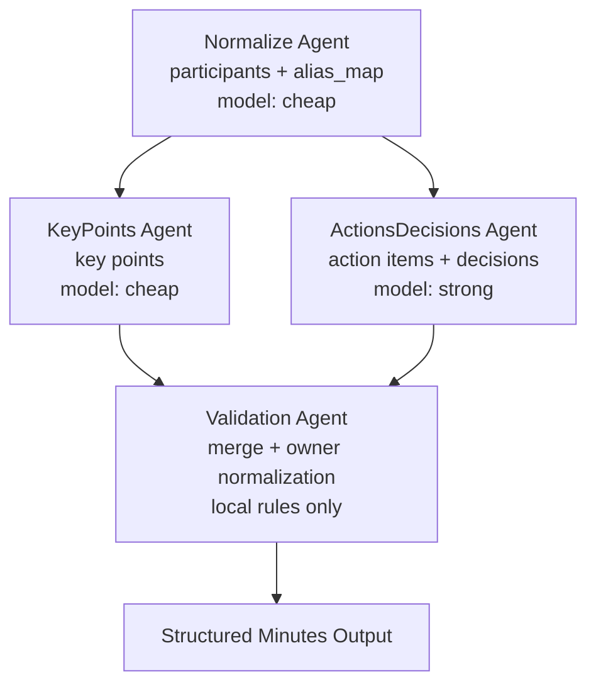

# V2 Multi-Agent Workflow

V2 现在统一为一条 LangGraph 工作流，不再保留单独的 plain pipeline。四个核心 agent 已经完全拆到 `D:\Interview\Minsight\Core\v2\agents\` 目录中，一个角色一个文件。

## Agent Layout

- `normalize_agent.py`
  负责说话人、角色、别名归一，输出 `participants` 和 `alias_map`。
- `key_points_agent.py`
  基于 transcript 抽取会议要点。
- `actions_decisions_agent.py`
  结合 transcript 和 `alias_map` 抽取待办与决策。
- `repair_agent.py`
  当结构化解析失败时执行一次修复，供前三个 LLM agent 复用。
- `validation_agent.py`
  不调用 LLM，只做结果融合、owner 归一和最终输出整形。

## Orchestration

- `graph.py` 是唯一的编排入口。
- `normalize` 先执行，为后续两个抽取 agent 提供标准化上下文。
- `key_points` 和 `actions_decisions` 在图中 fan-out 并行执行。
- `validate` 在 fan-in 节点汇总结果，生成最终结构化纪要。

## Why This Shape

- 抽取任务目标稳定、阶段明确，适合工作流式编排。
- 四个 agent 是固定职责分工，不需要额外的自治协商层。
- 拆到独立目录后，后续做单 agent 评测、替换模型路由、加 tracing 或重试策略都会更容易。
