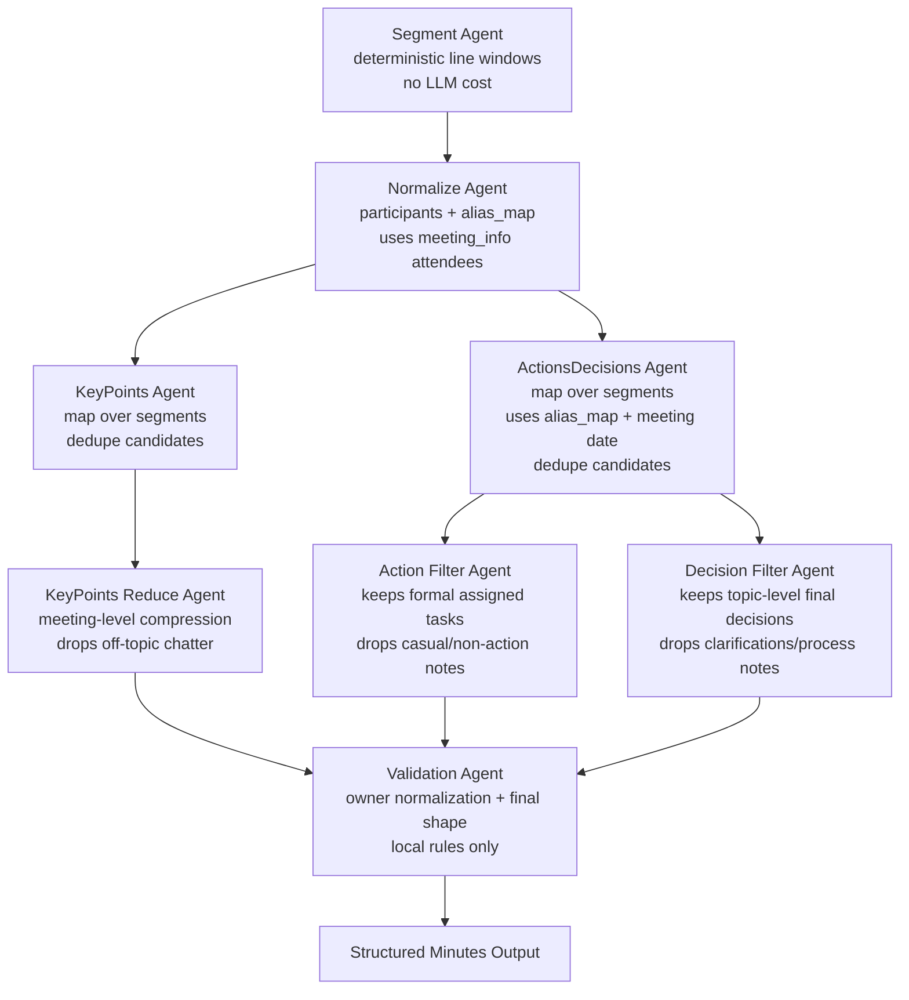

# Minsight V2 Agent Architecture

V2 is the production extraction workflow. It is orchestrated by LangGraph and
implemented as small agents under `Core/v2/agents/`.

## Current Workflow

## Agent Responsibilities

- `segment_agent.py`: Splits long transcripts into ordered line windows with a
  small overlap. Short transcripts are passed through as one segment, so normal
  meetings do not pay extra LLM cost.
- `normalize_agent.py`: Extracts participants and alias mapping. It treats
  `meeting_info.attendees` as the authoritative roster when present.
- `key_points_agent.py`: Extracts key-point candidates per segment and removes
  exact duplicates.
- `key_points_reduce_agent.py`: Compresses noisy segment-level candidates into
  meeting-level topics. It drops off-topic chatter and tangents when candidate
  count exceeds the desired final range.
- `actions_decisions_agent.py`: Extracts action items and decisions per segment.
  It injects the alias map and `meeting_info.date` into every map call, then
  removes duplicate candidates.
- `action_filter_agent.py`: Filters segment-level action candidates into final
  meeting-level tasks. It keeps formal assigned work and drops casual
  follow-ups, already-completed items, parking-lot notes, and vague tasks.
- `decision_filter_agent.py`: Filters candidate decisions down to final
  topic-level decisions. It is designed to remove clarifications, process
  discussion, implementation details, and duplicate decisions.
- `repair_agent.py`: Performs one structured-output repair attempt for LLM
  agents when JSON parsing or pydantic validation fails.
- `validation_agent.py`: Produces the final output shape and normalizes action
  owners through the alias map. It does not call an LLM.

## W2 Hardening Decisions

- Long meetings use deterministic segmentation before extraction. This reduces
  omission risk on cases such as `real_world_kickoff` without adding an LLM call
  just to split text.
- Map/reduce currently applies to `key_points` and `actions_decisions`.
  `normalize` still reads the full transcript so the roster and aliases remain
  global.
- Segment-level map calls run through a shared `ThreadPoolExecutor` helper.
  Results preserve segment order, while the LLM calls overlap to reduce
  wall-clock benchmark time.
- Parallelism is controlled by `MINSIGHT_SEGMENT_WORKERS` and defaults to `2`.
  Lower it when using stricter API rate limits; raise it only after confirming
  provider quota headroom.
- Lab benchmark case-level prediction/judge concurrency is separately
  controlled by `MINSIGHT_BENCHMARK_WORKERS` and also defaults to `2`.
- Real LLM calls retry transient 429/rate-limit/timeout errors with exponential
  backoff.
- Lab run details expose `run_health`, so benchmark summaries can distinguish
  model-quality regressions from infrastructure/runtime failures.
- Key-point reduce is cost-gated: small candidate sets pass through, while noisy
  long-meeting candidate sets get one extra reduce call.
- Action filtering runs when there are multiple action candidates. Benchmark
  run `4ba29fdf` showed action precision, not decision quality, was the main
  source of the overall regression, so action recall and action precision are
  now separate workflow responsibilities.
- Decision filtering runs when there are decision candidates, because benchmark
  failures showed repeated over-extraction of clarifications and process notes.
- Short meetings keep the old cost profile: one segment means one key-point call
  and one actions/decisions call.
- Roster and date context are injected into extraction prompts through existing
  `meeting_info`, so nickname normalization and relative-date normalization do
  not require extra scenario data.

## Next W2 Candidates

- Add a lightweight `verify_agent.py` pass for long meetings only. It should ask
  whether topic-level exclusions, priority changes, and final selections are
  missing from decisions.
- Add segment relevance gating for very long real transcripts, so off-topic
  segments can be skipped before extraction rather than removed only at reduce.
- Add confidence fields only after the benchmark UI has a clear place to show
  confidence diagnostics.
