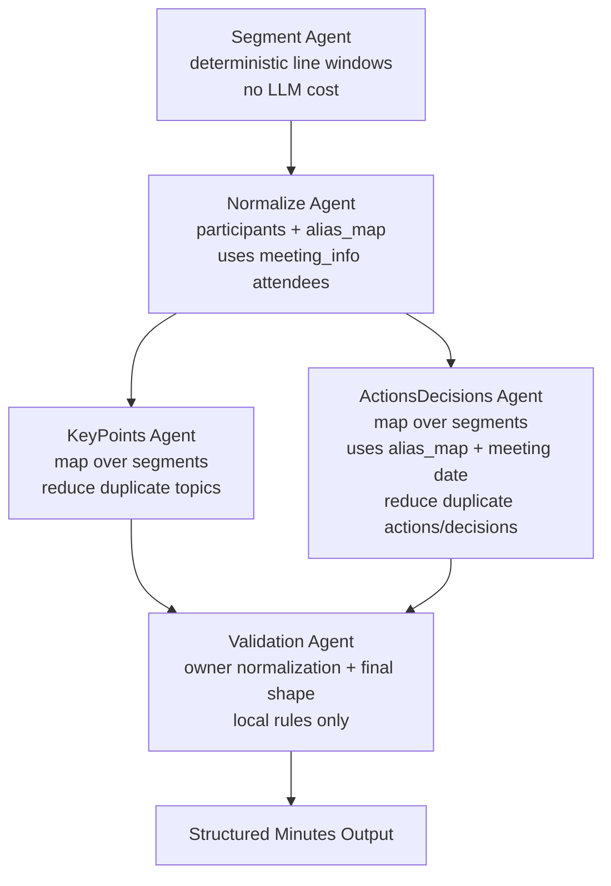

# Minsight V2 Agent Architecture

V2 is the production extraction workflow. It is orchestrated by LangGraph and
implemented as small agents under `Core/v2/agents/`.

## Current Workflow

## Agent Responsibilities

- `segment_agent.py`: Splits long transcripts into ordered line windows with a
  small overlap. Short transcripts are passed through as one segment, so normal
  meetings do not pay extra LLM cost.
- `normalize_agent.py`: Extracts participants and alias mapping. It treats
  `meeting_info.attendees` as the authoritative roster when present.
- `key_points_agent.py`: Extracts key points per segment and reduces duplicates
  by stable topic/summary keys.
- `actions_decisions_agent.py`: Extracts action items and decisions per segment.
  It injects the alias map and `meeting_info.date` into every map call, then
  reduces duplicate actions and decisions.
- `repair_agent.py`: Performs one structured-output repair attempt for LLM
  agents when JSON parsing or pydantic validation fails.
- `validation_agent.py`: Produces the final output shape and normalizes action
  owners through the alias map. It does not call an LLM.

## W2 Hardening Decisions

- Long meetings use deterministic segmentation before extraction. This reduces
  omission risk on cases such as `real_world_kickoff` without adding an LLM call
  just to split text.
- Map/reduce currently applies to `key_points` and `actions_decisions`.
  `normalize` still reads the full transcript so the roster and aliases remain
  global.
- Short meetings keep the old cost profile: one segment means one key-point call
  and one actions/decisions call.
- Roster and date context are injected into extraction prompts through existing
  `meeting_info`, so nickname normalization and relative-date normalization do
  not require extra scenario data.

## Next W2 Candidates

- Add a lightweight `verify_agent.py` pass for long meetings only. It should ask
  whether topic-level exclusions, priority changes, and final selections are
  missing from decisions.
- Split decision extraction into recall-first candidates and rubric filtering.
  This should target the `real_01` under-extraction vs `nick_01` over-extraction
  tension.
- Add confidence fields only after the benchmark UI has a clear place to show
  confidence diagnostics.
