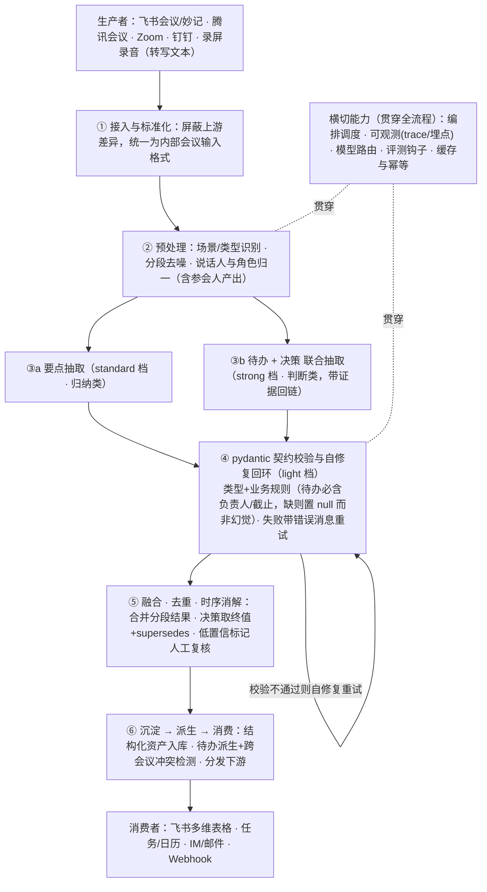

# Minsight — V1 诊断与 V2 方案

> 覆盖作业 Task 02（诊断 V1 架构）、Task 03（改进方案 V2）、Task 05（更多优化 · 评测方案）。
> Task 01（需求场景）与产品定位见同目录《Minsight_PRD.md》，Task 04（原型）单独交付。

---

## 一、V1 架构回顾

V1 是同事实现的最初版本：把完整转写文本塞进一个 prompt，单次调用大模型直出 JSON。

```python
def extract_meeting_minutes(transcript: str) -> dict:
    prompt = f"""你是专业的会议纪要助手。请从以下会议转写文本中提取：
    1. 参会人列表（含角色）2. 关键讨论要点
    3. 待办事项（含负责人和截止时间）4. 决策结论
    要求输出 JSON 格式。转写文本：{transcript}"""
    response = llm.chat(model="gpt-4o", prompt=prompt, temperature=0.3)
    return json.loads(response)
```

本质是「拼 prompt → 一次 call → 一次 `json.loads` → 返回」。能跑 demo，但在业务与架构两个层面都撑不起企业级中台。

---

## 二、Task 02：V1 架构诊断

### 2.1 业务 / 效果层面

| # | 问题 | 翻车症状 |
|---|---|---|
| 1 | 长文本单次抽取 | 长会触发「lost in the middle」，中段待办/决策漏抽，会越长质量越差 |
| 2 | 四类信息耦合在一个 prompt | 注意力被摊薄、无法分别调优；改一处影响全局 |
| 3 | 无说话人/角色对齐 | 昵称与「我/咱们」指代无法归一，参会人不全、待办负责人错配 |
| 4 | 无证据溯源 | 结论无原文支撑、不可核对，幻觉不可查 |
| 5 | 无时序理解 | 会上先定 A 后改 B，易把作废结论当最终决策 |
| 6 | 要素缺失时幻觉 | 口语没说截止时间，模型凭空编一个填上 |
| 7 | 场景不区分 | 决策会/评审会/复盘会共用一套 prompt，泛化差 |

### 2.2 系统 / 架构层面

| # | 问题 | 后果 |
|---|---|---|
| 1 | `json.loads` 无兜底 | 输出多逗号/带代码块/截断即抛异常，整场零产出，单点脆弱 |
| 2 | 无 Schema 校验 | 字段缺失、类型错误、待办缺负责人也照单全收，脏数据流向下游 |
| 3 | 单次同步调用 | 长会延迟高、易超时，无法并行 |
| 4 | Token/成本不可控 | 全文塞入，成本随会议长度爆炸，超长会直接超上下文窗口 |
| 5 | 紧耦合、硬编码 | 模型名/prompt/解析写死，换私有化模型、加字段都要改代码 |
| 6 | 无幂等/无状态/无缓存 | 重跑即重复副作用，失败只能整场从头再来 |
| 7 | 零可观测性 | 无日志/埋点/trace，抽错了定位不到是哪一步 |
| 8 | 无评测闭环 | 效果不可度量，改好改坏全凭感觉 |
| 9 | 隐私/安全 | 整篇原文外发、无脱敏，敏感会议无法私有化 |
| 10 | 参数不合理 | `temperature=0.3` 对结构化抽取偏高；单模型硬编码，无法按任务选模型 |

### 2.3 一句话总结

V1 把一个本该是**多阶段、可校验、可观测、可扩展的数据处理流水线**，压成了「一个 prompt + 一次调用 + 一次 `json.loads`」。业务上牺牲了准确率、可信度、场景适应性；架构上牺牲了鲁棒性、可扩展性、可观测性与私有化能力。

---

## 三、Task 03：V2 改进方案

### 3.1 架构范式选型

会议信息抽取是**目标明确、步骤可预定义、强调确定性与可评测**的任务，不是开放式探索。因此：

- **主干用 Workflow（DAG 编排）**：步骤固定、可并行、每步可单独评测与优化、结果可复现。
- **不用纯 ReAct**：ReAct 适合路径不确定、边想边决定用什么工具的开放任务；抽取路径确定，用 ReAct 反而引入不确定性、更难评测、更贵。仅在**校验环节局部借用 ReAct 式自修复回环**（看着报错自己修正重试）。
- **不用重量级 MultiAgent**：抽取单元之间没有自由对话/协商，由编排层统一调度，是「专家分工」而非「自由协作」。真正的 MultiAgent 对此任务是过度设计，牺牲确定性、可控性与成本。

> 结论：主干 Workflow 保证确定性与可评测，局部 ReAct 处理校验自修复，抽取单元是专家分工 —— 在正确的地方用正确的范式。

### 3.2 V2 流水线



### 3.3 子抽取器收敛与模型分层路由

原则：**能并入的并入；按认知负荷分三档路由——轻活用 light、归纳用 standard、需推理用 strong。** 由 V1 的「四合一」先拆解、再按认知负荷收敛为两组抽取（要点组 / 待办+决策组，参会人并入归一）：

- **参会人** → 并入预处理的「说话人/角色归一」，不单独调用（识别谁在场、什么角色本就是归一的副产物）。
- **要点** → 归纳性、容错高 → `standard` 中档。
- **待办 + 决策** → MVP 阶段合并为一次「需推理的抽取」。两者都需判断（是否真待办、谁负责、截止推断、决策终值与是否推翻）且高度相关（决策常直接派生待办），合用 `strong` 档可共享上下文。待评测证明互相干扰，V3 再拆开。

**模型分层路由（核心成本设计，三档）：**

按认知负荷分三档 `light / standard / strong`，每个 Agent 路由到一档：

| 处理环节（Agent） | 认知负荷 | 模型档位 |
|---|---|---|
| 说话人/角色归一（含参会人） | 抽取类，基本无需推理 | `light` 轻量/最便宜快 |
| 格式校验与自修复 | 照错改格式，不需思考 | `light` |
| 要点抽取 | 归纳类，容错高 | `standard` 中档均衡 |
| 待办 + 决策抽取判断 | 需推理（责任、时序、真伪） | `strong` 强推理 |

一场会里 strong 档只在最该用的一处出现，大头走 light/standard —— **准确率提升与成本可控同时成立，且可由评测数据量化证明。** 三档与"哪个模型用在哪个 Agent"完全由配置决定（见第六节），不写死任何厂商/模型。

### 3.4 V1 病灶 → V2 对策

| V1 病灶 | V2 对策 |
|---|---|
| 长文本单次调用漏抽 | 预处理分段 + 要点 map-reduce |
| 四类信息耦合 | 按认知负荷分层抽取（要点 / 待办+决策） |
| 说话人/负责人错配 | 预处理阶段说话人与角色归一 |
| `json.loads` 一崩即死 | pydantic 契约校验 + 自修复重试回环 |
| 要素缺失时幻觉 | 业务规则校验，缺则标记 missing |
| 决策反复抽错 | 融合阶段时序消解 + supersedes |
| 结果不可信 | 全程证据回链 |
| 硬编码不可扩展/私有化 | 横切：模型路由 + 编排 + 适配器 |
| 无法度量迭代 | 横切：评测钩子 + 埋点 |
| 成本/延迟不可控 | 模型分层路由 + 分段并行 |

---

## 四、迭代路线 V2 → V3 → V4

| 版本 | 重点 | 内容 |
|---|---|---|
| **V2（MVP）** | 精简可跑的正确骨架 | 约 3 次模型触点（归一 / 要点 / 待办+决策）；校验自修复走 light 档；时序消解、并行、跨会议冲突先留桩 |
| **V3** | 精度与智能增强 | 拆开待办与决策为独立子链；强化时序消解；引入**置信度路由**（低档先跑，低置信条目才升级到 strong 重抽）；接入跨会议去重/冲突；**契约驱动的 structured outputs**（真实模型直吃 pydantic 模型，减少解析/修复开销） |
| **V4** | 平台化与自进化 | 场景化抽取配置（按会议类型切 prompt/字段）；多模型级联与动态路由；增量/流式处理；用人工纠正数据做主动学习优化 |

---

## 五、Task 05：评测方案（横向对比 v1 → v4）

评测既是「对交付效果负责、持续迭代直至指标达标」的抓手，也是原型可实跑的部分（先跑通 v1 vs v2）。

### 5.1 统一评测集（gold set）

构造一批**带人工标准答案**的会议样本，每条含转写文本 + 标准结构化答案（参会人/角色、要点、待办[负责人+截止]、决策[终值]）。规模先小（20–50 场）但**六类场景全覆盖**：长会、决策反复、要素缺失、昵称指代、中英混说、多话题。来源：mock 生成 + 真实脱敏。

### 5.2 统一协议

同一批输入喂给 v1/v2/v3/v4，都输出统一 schema，自动与 gold 比对。**版本可插拔、输入固定**，保证公平对比。

### 5.3 分维度指标

| 维度 | 指标 | 评法 |
|---|---|---|
| 参会人 | 准确率/召回、角色正确率 | 集合精确匹配 |
| 要点 | 覆盖率（gold 要点被命中比例） | 语义相似 / LLM-judge |
| 待办 | F1、负责人正确率、截止时间正确率 | 结构字段规则匹配 |
| 决策 | 正确率、**反复场景取终值正确率** | LLM-judge + 人工抽检 |
| 可信 | **幻觉率**（无原文支撑条目占比） | 证据回链核验 / judge |
| 鲁棒 | 格式合法率（schema 通过率） | 规则（V1 在此现原形） |
| 工程 | 平均延迟、token/成本、失败率 | 运行时打点 |

### 5.4 方法学要点

- 结构化字段（参会人、截止时间、格式）用**规则精确匹配**，客观可复现。
- 语义字段（要点、决策）用 **LLM-as-judge**，但 judge 须固定 prompt、低温、可复现，并**用人工标注抽样校准 judge 本身的一致性** —— 否则「用大模型评大模型」不可信。
- 每条 case 出 **per-scenario 分数**，定位某版本在哪类场景改善。

### 5.5 呈现与防回归

- 一张「版本 × 指标」对比表 + 按场景热力图，直观看每次迭代提升在哪。
- 设**回归红线**：新版本不得在旧指标上倒退。
- 叠加**成本-效果联合视图**，量化证明便宜模型档没有显著掉点却省了钱 —— 这是模型路由的数据背书。

### 5.6 Lab 项目化与测评流程

测评逻辑已与 `Core/` 解耦，单独做成 `Lab/` 项目，职责边界明确：

- `Core/` 只保留 V1 / V2 Agent 实现与测试集；
- `Lab/` 负责拉起两个版本跑测试集、结果入库、再从库中取出做测评；
- 评测存储先用 SQLite，后续可平滑替换为 PostgreSQL / pgvector。

当前采用的测评主流程：

1. 读取 `Core/data/scenarios/*.json` 的带 gold 样本；
2. 启动 V1 与 V2 两个版本，直接走真实 LLM；
3. 将每条预测结果连同 `case_id / scenario / routing / gold / output` 落入数据库；
4. 再由 Lab 从数据库读取预测结果，用 `LLM judge` 对 `participants / key_points / action_items / decisions / overall` 五个维度打分；
5. 聚合生成版本对比摘要，作为 prompt / 模型 / 架构迭代的依据。

这样做的价值是：评测不再耦合抽取实现，数据库成为“运行事实”的单一来源，后续可自然扩展到历史对比、重评、抽检与看板。

### 5.7 持续化

评测做成一键脚本 / CI 钩子，每次改 prompt、换模型自动跑；线上 `human_correction` 埋点数据持续回流，扩充 gold set。

---

## 六、工程实现与落地（Core + Lab）

工程交付现在拆成两个项目：`Core/` 负责抽取器，`Lab/` 负责测评。两者都走真实模型，不再保留离线模拟分支。

### 6.1 项目结构（V1、V2 独立，共享底座）

```
Core/
├── shared/   config.py(读 .env) · llm.py(真实客户端) · backends/(real.py) · prompts.py · schema.py · dataio.py
├── prompts/  提示词按项目隔离：prompts/v1/ 与 prompts/v2/，各自维护、改文件即调 prompt
├── data/scenarios/*.json  6 个场景测试集（决策反复/要素缺失/昵称指代/长会/中英混/多话题）
├── v1/       单次调用基线（独立项目）
├── v2/       pipeline.py(纯代码) + graph.py(LangGraph) + architecture.md
└── run.py    Core 入口：人工查看某个版本输出

Lab/
├── run.py        拉起 V1 / V2、落库、再执行 LLM judge
├── store.py      Store 抽象的 SQLite 实现
├── judge.py      评委模型封装
├── prompts/      judge prompt
└── results/      每次评测的摘要产物
```

### 6.2 三档模型 + 按 Agent 路由（`.env` 配置，不写死厂商/模型）

两层配置：① 定义 `light / standard / strong` 三个模型档位 profile（每档一套 OpenAI 兼容 `base_url/api_key/model`，可自定义更多）；② 把每个 Agent 路由到某个 profile（`AGENT_<X>=<profile>`），即"哪个模型用在哪个 Agent"。默认：归一/自修复→light，要点→standard，待办+决策/V1/Lab judge→strong。至少要配置一个可用 profile，否则程序启动即报错。运行结束打印 `agent -> profile / model`。

### 6.3 提示词可配置

所有 prompt 外置到 `prompts/`，并**按项目隔离**成 `prompts/v1/` 与 `prompts/v2/`，两个项目各维护自己的一套、互不影响（占位符 `{{TRANSCRIPT}}`/`{{ALIAS_MAP}}`/`{{RAW}}`，`str.replace` 渲染）。改文件即可调优，无需动代码——对应岗位的 PE 调优诉求。

### 6.4 结构化输出契约（pydantic 校验）

V2 的"④校验"用 pydantic 把 schema 与业务规则声明成显式契约（`shared/models.py`），取代临时 dict 检查：

- **实体模型**：`Participant / KeyPoint / ActionItem / Decision`，字段带类型；每个子抽取器有独立输出模型（`ParticipantsOut / KeyPointsOut / ActionsDecisionsOut`），哪一步不合规就在哪一步暴露。
- **业务规则即校验器**：待办 `due` 缺失（含"未提及/无/TBD"等写法）一律归一为 `None`，**不臆造**；`owner` 必填，缺失即 `ValidationError`。
- **契约驱动的自修复**：解析或字段级校验失败时，把 `ValidationError` 的错误消息一并喂回 repair agent 让模型改（局部 ReAct），再校验——比只兜格式更进一步，能兜到字段级不合规。
- **V1 保持 naive**：只 `json.loads`、不上 pydantic，以对照其脆弱（这是评测的对比卖点）。
- **真实模式加成**：OpenAI 兼容的 structured outputs 可直接吃 pydantic 模型，真实模型更易一次产出合规 JSON。

对下游而言，这是"可信数据"的类型级硬保证，直接对应岗位"对交付效果负责"。

### 6.5 LangGraph 落地与选型

V2 提供两份等价实现，共用同一批 stage 函数：`pipeline.py`（纯代码顺序编排，透明便于讲解）与 `graph.py`（LangGraph `StateGraph`，`normalize →(key_points ∥ actions)→ validate → END`，并行分叉+汇聚+校验自修复，真实运行默认走这版）。选型理由：抽取任务目标明确、步骤可预定义、强调确定性与可评测 → **Workflow(图编排)为主干 + 模型路由 + 多专家节点**；ReAct 仅在校验自修复处局部借用；各节点是专家分工而非自由协作，无需重量级 MultiAgent。LangGraph 的价值在于把这套范式框架化：显式图/状态、条件边与循环、checkpoint/streaming/可观测等工程能力开箱即用。

### 6.6 存储层与数据库驱动评测

抽取结果的落地与评测已按“先存储、再评测”的思路重构：

- Lab 的默认 Store 为 SQLite，保存 `run / prediction / judgement` 三类记录；
- `prediction` 记录保留 `transcript / gold / output / routing`，既能复盘，也能支持重评；
- `judgement` 记录保存 LLM judge 的原始 JSON 与各维度分数，后续可直接用于版本对比、看板和抽样复核；
- 这个 Store 已抽象成独立模块，后续替换 PostgreSQL / pgvector 时，上层跑测与 judge 流程无需改动。

### 6.7 当前取舍

为了避免为“语义相似度”再引入额外 embedding / 相似度模型 API，当前版本统一采用 `LLM judge` 作为语义评委；结构仍保留数据库中间层，方便之后补充规则指标或更换 judge 策略。

---

## 附录：与作业 Task 的对应

| 作业 Task | 落点 |
|---|---|
| Task 01 需求场景分析 | PRD 第四节 + PRD 附录 B |
| Task 02 诊断 V1 | 本文第二节 |
| Task 03 改进 V2 | 本文第三节 + 第四节迭代路线 |
| Task 04 原型 | 本文第六节 + `Core/`（抽取器） + `Lab/`（独立测评） |
| Task 05 更多优化 | 本文第四节 + 第五节评测方案 |

---

## 2026-07-18 当前实现补充：V1 / V2 / Lab 评测口径

### V1 当前定位

V1 保持题目中的基线实现风格：

- 单次 prompt 调用。
- 直接要求 JSON。
- 直接 `json.loads`。
- 不做 pydantic 校验。
- 不做 repair。
- 不做额外后处理。

这让 V1 成为清晰的 baseline，用来对比 V2 的工作流、校验、证据回链和业务闭环价值。

### V2 当前定位

V2 是当前业务演示主路径：

- `Core/v2/graph.py` 是唯一编排入口。
- 四类能力拆到 `Core/v2/agents/` 下的独立 agent 文件。
- 工作台页面只跑 V2，避免把业务 demo 变成测试台。
- benchmark 页面不再跑 V1；V1 只作为 archived baseline 保留。
- benchmark 页面比较当前正式 Agent 与上一次同任务 run 的 V2 分数差异。

### Lab 当前定位

Lab 是独立的评测与演示项目，负责：

- 启动 V1/V2 跑共享测试集。
- 把预测结果落库。
- 从库中读取预测结果做 LLM judge。
- 展示历史 runs、逐 case 详情、原始结构化输出、维度分数。
- 提供 Workbench 业务 demo：可读纪要、evidence、派生 tasks、跨会议提示。

### 当前 benchmark 数据集

测试数据位于 `Core/data/scenarios/*.json`。
目前保留 6 个场景，每个场景侧重不同能力：

| 场景 | 评测重点 |
|---|---|
| `decision_reversal` | 决策反复、旧决策被新决策覆盖。 |
| `long_meeting` | 长会议、多议题、排除项、后置更正。 |
| `missing_fields` | 缺失字段、隐含 owner/due、避免幻觉。 |
| `mixed_language` | 中英混合、英文产品术语、scope 裁剪。 |
| `multi_topic` | 多主题混杂、parking lot、共享负责人。 |
| `nickname_reference` | 昵称与代词解析、内部/客户 owner 区分。 |

每个 case 的 `gold` 是人工标准答案，包含 `participants / key_points / action_items / decisions`。

### 当前百分比结果来源

百分比不是代码规则直接算出的，也不是 embedding 相似度。
当前流程是：

1. 正式 Minsight Agent 生成 prediction。
2. prediction 和 gold 一起落 SQLite。
3. `Lab/judge.py` 调用强模型，根据 `Lab/prompts/judge.txt` 对 `prediction` 和 `gold` 逐维打分。
4. judge 返回 `0.0 ~ 1.0` 小数。
5. 前端乘以 100 显示为百分比。
6. 多 case 时按版本和维度做平均。
7. 如果存在上一次同 scenario/case 的 Agent 结果，则计算 current-minus-previous 分差供前端热力图展示。

因此，`overall = 67.5%` 的含义是：

> 在当前 judge prompt 和 gold 答案下，强模型评委给该版本整体匹配度打了 0.675 分。

这个指标适合作为迭代和面试演示中的可视化证据，但不是完全确定性的数学指标。
